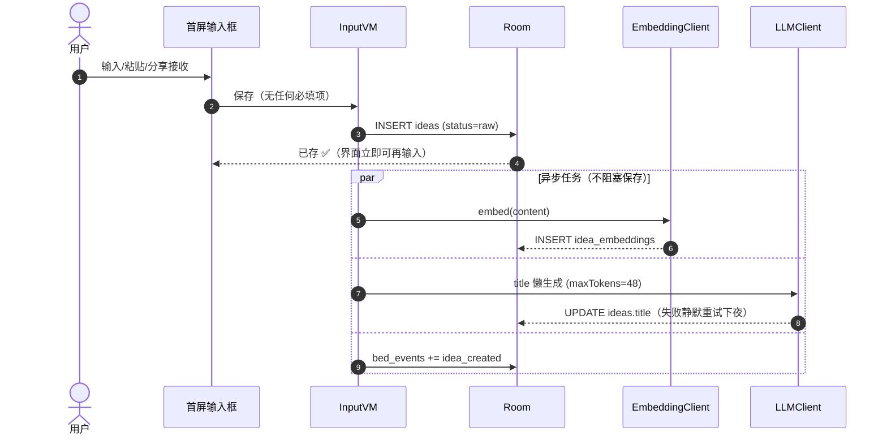
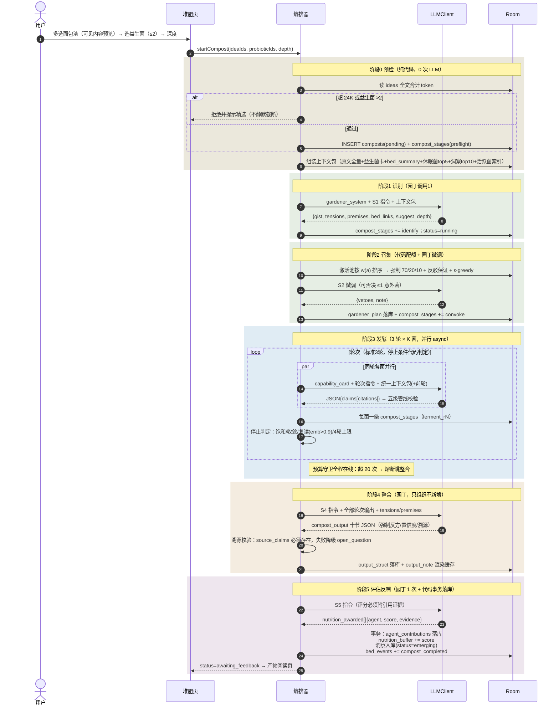
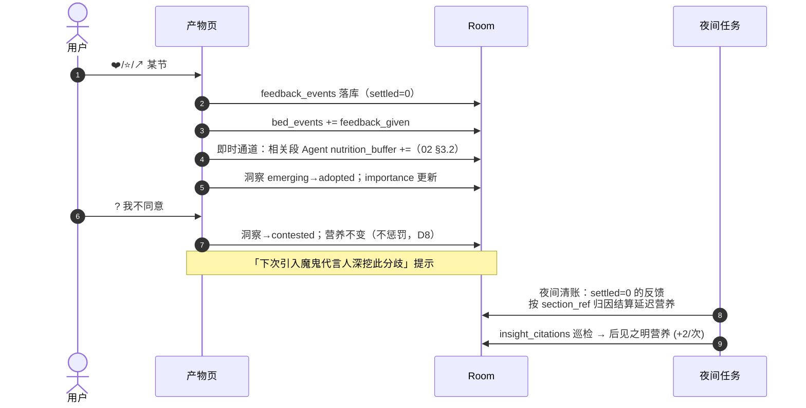
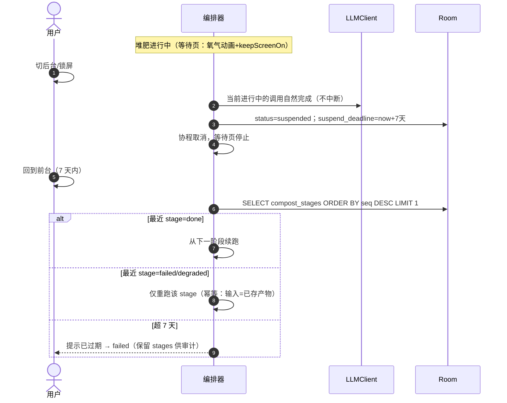
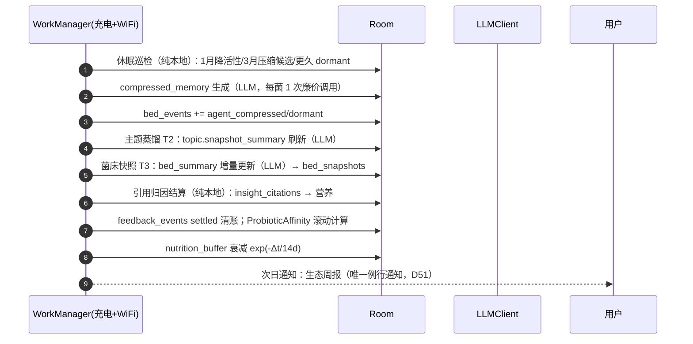
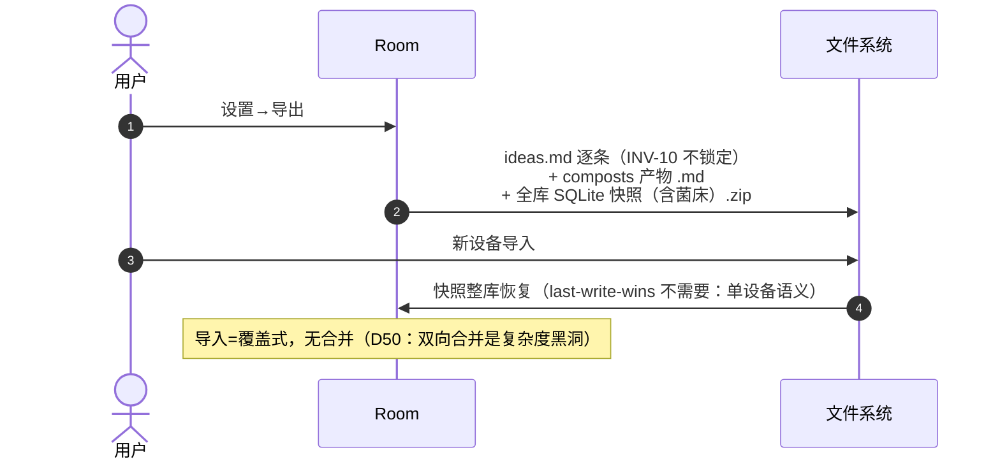
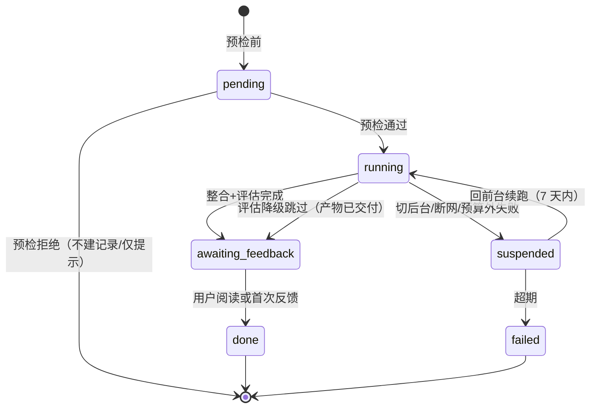

# 实操规约 03 · 核心时序图

> 路线图 ③。以 Mermaid 表达 MVP 全部关键路径；阶段编号对齐 `03-思想园丁调度协议`，表名对齐 `specs/01`。
>
> 参与者：`UI`（Compose 界面）/ `VM`（ViewModel）/ `ORC`（堆肥编排器，协程状态机）/ `LLM`（LLMClient，specs/02）/ `DB`（Room）/ `BG`（WorkManager 夜间任务）/ `EMB`（EmbeddingClient）

------

## 1. 丢面包渣（低阻力主路径，P-01）

> 保存路径上零 LLM/零向量调用——「丢进去就完成」是硬指标（INV-3）。

------

## 2. 一次标准堆肥（核心闭环，status 流转完整）

------

## 3. 用户反馈与延迟营养（P-03 闭环）

------

## 4. 挂起与恢复（INV-8 / 08 §7.1 诚实挂起）

------

## 5. 夜间生态任务（06 §5 sleep-time 清单）

------

## 6. 换机导出/导入（D50）

------

## 7. 状态机汇总（composts.status）

